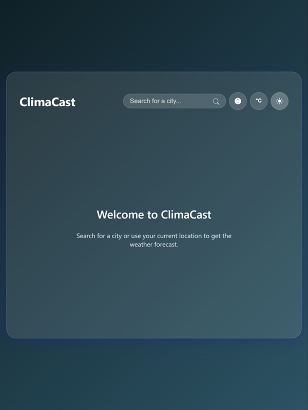
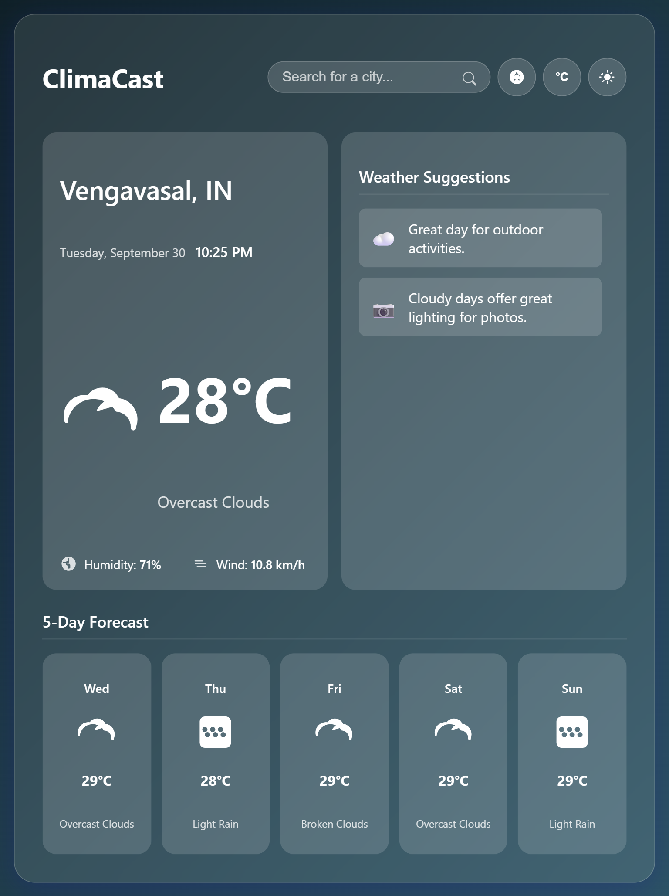

# 🌦️ ClimaCast - A Dynamic Weather Advisor

ClimaCast is a **clean, modern, and responsive weather dashboard** that provides **real-time weather information**, a **5-day forecast**, and **smart suggestions** based on current conditions.  
Built with **vanilla HTML, CSS, and JavaScript**, it delivers a beautiful and intuitive user experience **without any external frameworks**.

|  |  |
|-----------------------------------------|-----------------------------------------|


---

## ✨ Features

- **Real-Time Weather Data** → Up-to-the-minute info on temperature, humidity, wind speed, and conditions.  
- **5-Day Forecast** → Plan ahead with a detailed forecast.  
- **Geolocation Support** → Automatically fetch weather for your current location.  
- **Global City Search** → Look up weather anywhere in the world.  
- **Smart Suggestions** → Get advice like _"Don't forget your umbrella!"_.  
- **Unit Conversion** → Instantly switch between °C and °F.  
- **Light & Dark Modes** → Cloud-themed interface with preference saved.  
- **Live Local Clock** → Displays current time for the selected location.  
- **Fully Responsive** → Mobile-first design, works great on all devices.  
- **Zero Dependencies** → Pure **HTML + CSS + JavaScript**.  

---

## 🛠️ Technologies Used

- **HTML5** → Core structure and content  
- **CSS3** → Custom styling, animations, and responsive design  
- **JavaScript (ES6+)** → Application logic, API calls, DOM manipulation  
- **OpenWeatherMap API** → Weather & forecast data  
- **Browser Geolocation API** → Fetch user’s location  

---

## 🚀 Getting Started

Follow these steps to set up the project locally:

### ✅ Prerequisites
- You’ll need a **free API key** from [OpenWeatherMap](https://home.openweathermap.org/).
  1. Create a free account  
  2. Navigate to **API keys** tab  
  3. Copy your generated key  

---

### 📥 Installation

1. **Clone the repository**
   ```bash
   git clone https://github.com/Madhusudan043337/climacast-weather-app.git
   ```

2. **Navigate to the project folder**
   ```bash
   cd climacast-weather-app
   ```

3. **Add your API Key**
   - Open `script.js`
   - Locate the `apiKey` constant (line 2)
   - Replace the placeholder with your actual API key  

4. **Run the application**
   - Open `index.html` directly in your browser  

   > ⚠️ For the **geolocation feature**, you may need to run via a local server (e.g., VS Code [Live Server extension]) since some browsers block geolocation on `file:///` URLs.  

---

## 🙌 Acknowledgements

- [OpenWeatherMap](https://openweathermap.org/) for free weather API  
- [MDN Web Docs](https://developer.mozilla.org/) for web development references  
